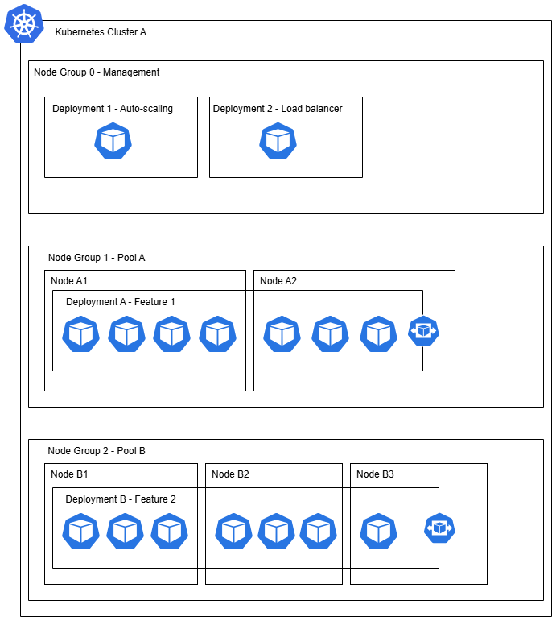

# Kubernetes & AWS

## Pre-requisites

**AWS Credentials**

```shell
# for envsubst
sudo apt install gettext-base

source ./load-env.sh # load .env variables
printenv | grep AWS

# Output
# AWS_REGION=...
# AWS_SECRET_ACCESS_KEY=...
# AWS_ACCOUNT_ID=...
# AWS_ACCESS_KEY_ID=...
# CLUSTER_NAME=...
# CLUSTER_REGION=...

envsubst < cluster-config.tpl.yaml > cluster-config.yaml
```

## Overview

An EKS cluster with 3 node groups :

* placement policies to deploy features on specific node groups
* auto-scaling for 2 node groups



## Install eksctl

According to [official documentation](https://eksctl.io/installation/)

**Unix Install**

```shell
# for ARM systems, set ARCH to: `arm64`, `armv6` or `armv7`
ARCH=amd64
PLATFORM=$(uname -s)_$ARCH

curl -sLO "https://github.com/eksctl-io/eksctl/releases/latest/download/eksctl_$PLATFORM.tar.gz"

# (Optional) Verify checksum
curl -sL "https://github.com/eksctl-io/eksctl/releases/latest/download/eksctl_checksums.txt" | grep $PLATFORM | sha256sum --check

tar -xzf eksctl_$PLATFORM.tar.gz -C /tmp && rm eksctl_$PLATFORM.tar.gz

sudo mv /tmp/eksctl /usr/local/bin
```

**MacOS Install**

```shell
brew tap weaveworks/tap
brew install weaveworks/tap/eksctl
```

## Cheat sheet

### Check versions

```shell
# link to AWS
aws configure
aws sts get-caller-identity

# Check kubectl
kubectl version --client

# register remote cluster
aws eks update-kubeconfig --region $AWS_REGION --name $CLUSTER_NAME
kubectl config set-context --current --namespace=$CLUSTER_NAME

# check kubectl
kubectl config get-contexts
kubectl config get-contexts arn:aws:eks:$AWS_REGION:$AWS_ACCOUNT_ID:cluster/$CLUSTER_NAME
kubectl config current-context
kubectl config view --minify -o jsonpath='{.contexts[0].context.namespace}'
```

### EKS management

Check [AWS > EKS > Quick start](https://docs.aws.amazon.com/fr_fr/eks/latest/userguide/quickstart.html)

```shell
eksctl create cluster -f cluster-config.yaml
eksctl create cluster -n my-project --region=$AWS_REGION

export CLUSTER_REGION=$AWS_REGION
export CLUSTER_VPC=$(aws eks describe-cluster --name $CLUSTER_NAME --region $CLUSTER_REGION --query "cluster.resourcesVpcConfig.vpcId" --output text)

# Run project
kubectl create namespace game-2048 --save-config
kubectl apply -n game-2048 -f https://raw.githubusercontent.com/kubernetes-sigs/aws-load-balancer-controller/v2.8.0/docs/examples/2048/2048_full.yaml
kubectl delete -n game-2048 -f https://raw.githubusercontent.com/kubernetes-sigs/aws-load-balancer-controller/v2.8.0/docs/examples/2048/2048_full.yaml

helm repo add eks https://aws.github.io/eks-charts
helm repo update eks
helm install aws-load-balancer-controller eks/aws-load-balancer-controller \
    --namespace kube-system \
    --set clusterName=$CLUSTER_NAME \
    --set serviceAccount.create=false \
    --set region=${CLUSTER_REGION} \
    --set vpcId=${CLUSTER_VPC} \
    --set serviceAccount.name=aws-load-balancer-controller

kubectl get ingress -n game-2048

# To delete a cluster, no service should be running
kubectl get svc --all-namespaces
kubectl delete svc service-name
eksctl delete cluster -f cluster-config.yaml
eksctl delete cluster -n my-project
```

### Kubernetes commands

```shell
kubectl exec -it my-pod --container app-demo -- /bin/bash
```

## EKS Auth

Côté AWS pour le root user, on peut avoir l'erreur

> Your current IAM principal doesn’t have access to Kubernetes objects on this cluster.

Pour cela, il faut aller dans _EKS > Clusters > "myCluster" > Access tab > Create access entry_ (cf [Stackoverflow](https://stackoverflow.com/a/71100502/2874009))

Et déclarer les accès pour arn:aws:iam::$AWS_ACCOUNT_ID:root

* policies : `AmazonEKSClusterAdminPolicy`
  * Pas oublier de cliquer sur "Add policy"

## K8s auto-complete

[Doc officielle](https://kubernetes.io/docs/reference/kubectl/quick-reference/#kubectl-autocomplete)

Exemple pour bash :

```shell
source <(kubectl completion bash) # set up autocomplete in bash into the current shell, bash-completion package should be installed first.
echo "source <(kubectl completion bash)" >> ~/.bashrc # add autocomplete permanently to your bash shell.
alias k=kubectl
complete -o default -F __start_kubectl k
```

## ECR for Docker images

```shell
aws ecr get-login-password --region $AWS_REGION | docker login --username AWS --password-stdin $AWS_ACCOUNT_ID.dkr.ecr.$AWS_REGION.amazonaws.com

docker compose build
docker compose push
```

## Portainer configuration _(Untested)_

Prerequisite: A working portainer server.

Then:

* deploy the Portainer Agent on the Kubernetes cluster: `portainer-agent-k8s-nodeport.yaml`
* Go to Portainer Server & connect to the agent

# Summary

```shell
eksctl create cluster -f cluster-config.yaml
aws eks update-kubeconfig --region $CLUSTER_REGION --name $CLUSTER_NAME
k get nodes --selector grp-role=management

k apply -f k8s/demo/demo-core.yaml
k config set-context --current --namespace=demo

# check auto-scaling section now

k apply -f k8s/demo/demo-lb.yaml

export CLUSTER_VPC=$(aws eks describe-cluster --name $CLUSTER_NAME --region $CLUSTER_REGION --query "cluster.resourcesVpcConfig.vpcId" --output text)

helm repo add eks https://aws.github.io/eks-charts
helm repo update eks
helm install aws-load-balancer-controller eks/aws-load-balancer-controller \
    --namespace kube-system \
    --set clusterName=$CLUSTER_NAME \
    --set serviceAccount.create=false \
    --set region=${CLUSTER_REGION} \
    --set vpcId=${CLUSTER_VPC} \
    --set serviceAccount.name=aws-load-balancer-controller

k get ingress -n demo

docker compose build
docker compose push
k apply -f k8s/demo/demo-core.yaml

k scale deployment/deployment-demo --replicas=10
# check AWS Console to configure EKS Auto Mode from overview

k delete -f k8s/demo/demo-core.yaml -f k8s/demo/demo-lb.yaml
eksctl delete cluster -f cluster-config.yaml
```


## Auto scaling encore

Ajouter ces policies à l'auto-scaling group

```json
{
  "Version": "2012-10-17",
  "Statement": [
    {
      "Effect": "Allow",
      "Action": [
        "autoscaling:DescribeAutoScalingGroups",
        "autoscaling:DescribeAutoScalingInstances",
        "autoscaling:SetDesiredCapacity",
        "autoscaling:TerminateInstanceInAutoScalingGroup"
      ],
      "Resource": "*"
    }
  ]
}
```

Pour tricher, on peut mettre AutoScalingFullAccess

Ou alors ça fonctionne si on le met dans cluster config (cf [eksctl schema](https://eksctl.io/usage/schema))

Egalement activer EKS Auto Mode via la console.

Ajouter à eksctl-$CLUSTER_NAME-cluster-ServiceRole-7QS5IRmbtkBk les règles

AmazonEKSBlockStoragePolicy
AmazonEKSComputePolicy
AmazonEKSLoadBalancingPolicy
AmazonEKSNetworkingPolicy

https://docs.aws.amazon.com/eks/latest/userguide/automode-get-started-eksctl.html


Création d'un seul role IAM sur le compte AWS pour l'administration d'un cluster EKS

* AmazonEKSBlockStoragePolicy
* AmazonEKSClusterPolicy
* AmazonEKSComputePolicy
* AmazonEKSLoadBalancingPolicy
* AmazonEKSNetworkingPolicy
* AmazonEKSVPCResourceController


Cluster role missing recommended managed policies
The cluster role must have the following managed policies or equivalent permissions to use EKS Auto Mode:
AmazonEKSBlockStoragePolicy
AmazonEKSComputePolicy
AmazonEKSLoadBalancingPolicy
AmazonEKSNetworkingPolicy


Puis

```shell
helm repo add autoscaler https://kubernetes.github.io/autoscaler

# KO Method 1 - Using Autodiscovery
# helm install aws-eks-autscaler autoscaler/cluster-autoscaler \
#     --set 'autoDiscovery.clusterName'=$CLUSTER_NAME

# TODO: find a way to
#   * automatically add policies
#   * find auto-scaling group name

# Method 2 - Specifying groups manually
# export NODE_GROUP_MNG_ASG_NAME="eks-eks-mng-cec9dafe-6972-b52e-3e93-bd6e75c7ea03"
export NODE_GROUP_ASG_NAME_1=$(aws autoscaling describe-auto-scaling-groups \
  --query "AutoScalingGroups[?Tags[?Key=='eks:nodegroup-name' && Value=='eks-grp-1']].AutoScalingGroupName | [0]" \
  --output text)
export NODE_GROUP_ASG_NAME_2=$(aws autoscaling describe-auto-scaling-groups \
  --query "AutoScalingGroups[?Tags[?Key=='eks:nodegroup-name' && Value=='eks-grp-2']].AutoScalingGroupName | [0]" \
  --output text)

# https://github.com/kubernetes/autoscaler/blob/master/charts/cluster-autoscaler/values.yaml
helm install aws-eks-autoscaler autoscaler/cluster-autoscaler \
    --namespace kube-system \
    --set "autoscalingGroups[0].name=$NODE_GROUP_ASG_NAME_1" \
    --set "autoscalingGroups[0].maxSize=5" \
    --set "autoscalingGroups[0].minSize=0" \
    --set "autoscalingGroups[1].name=$NODE_GROUP_ASG_NAME_2" \
    --set "autoscalingGroups[1].maxSize=5" \
    --set "autoscalingGroups[1].minSize=0" \
    --set nodeSelector."grp-role"=management \
    --set "extraArgs.scale-down-delay-after-add=1m" \
    --set "extraArgs.scale-down-unneeded-time=1m" \
    --set awsRegion=$AWS_REGION

# kubectl get pods --all-namespaces -o wide --field-selector spec.nodeName=...
./helpers/show-node-groups.sh
./helpers/logs-autoscaler.sh

helm upgrade/uninstall aws-eks-autoscaler
```


## Manager app

```shell
k apply -f k8s/manager/manager.yml
k get pods --selector=app=manager-app -n default
k exec -it manager-app-55c6747c7c-g9mwb -- bash
node kube/scale-pods.js
exit
k get pods --selector=app.kubernetes.io/name=app-demo-2 -A
k apply -f k8s/demo-2/demo-2-core.yaml
k rollout status deployment/deployment-demo-2 -n demo-2
k set image deployment/deployment-demo-2 app-demo-2=$AWS_ACCOUNT_ID.dkr.ecr.$AWS_REGION.amazonaws.com/demo/api:0.0.4 -n demo-2
```
